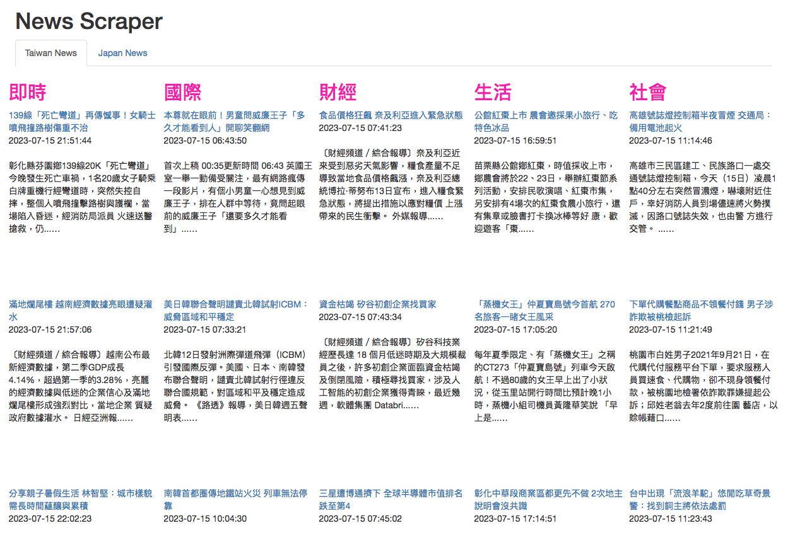
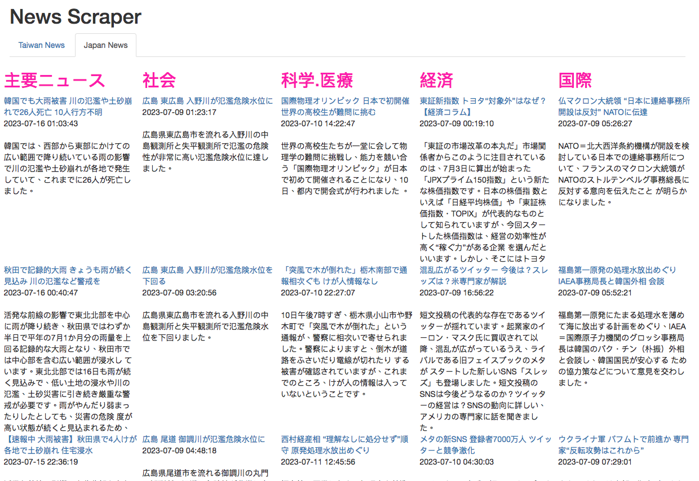

# Taiwan and Japan News Scraper

This program collects and aggregates news from various Taiwanese and Japanese news RSS feeds. It enables users to filter news based on specific keywords, adjust the display order of news items, and limit the number of news items displayed per feed. In addition, users can hide news from categories they are not interested in.

## Usage

1. Install the requirements by running `pip install Flask feedparser BeautifulSoup Flask-Bootstrap`.
2. To collect and display Taiwan news, run `python taiwan_news_scraper.py`. This program uses the `news_template.html` file to structure the news.
3. To collect and display Japan news, run `python nhk_news_scraper.py`. This program uses the `nhk_news_template.html` file to structure the news.

Each program will generate an HTML file named news_output.html containing the news items aggregated from the specified RSS feeds.

## Configuration

You can modify the RSS feeds, exclusion keywords, lower-rank keywords, and hide categories in the `taiwan_news_scraper.py` and `nhk_news_scraper.py` files.

# 台湾・日本ニューススクレーパー

このプログラムは、様々な台湾と日本のニュース RSS フィードからニュースを収集し、集約します。ユーザーは、特定のキーワードに基づいてニュースをフィルタリングし、ニュース項目の表示順序を調整し、フィードごとに表示されるニュース項目の数を制限することができます。さらに、ユーザーは興味のないカテゴリーのニュースを非表示にすることができます。

## 使用方法

1. `pip install Flask feedparser BeautifulSoup Flask-Bootstrap` を実行して、必要なパッケージをインストールします。
2. 台湾のニュースを収集して表示するには、`python taiwan_news_scraper.py` を実行します。このプログラムは `news_template.html` ファイルを使ってニュースを構成します。
3. 日本のニュースを収集して表示するには、`python nhk_news_scraper.py` を実行します。このプログラムは `nhk_news_template.html` ファイルを使ってニュースを構成します。

各プログラムは、指定した RSS フィードから集約したニュース項目を含む `news_output.html` という名前の HTML ファイルを生成します。

## 設定

`taiwan_news_scraper.py` ファイルと `nhk_news_scraper.py` ファイルで、RSS フィード、除外キーワード、ランクを下げるキーワード、隠すカテゴリーを変更することができます。

# 台灣新聞擷取器與日本新聞擷取器

此程式從各種台灣與日本新聞 RSS 饋送中收集並聚合新聞。它允許使用者根據特定的關鍵詞過濾新聞、調整新聞項目的顯示順序、並限制每個饋送顯示的新聞項目數量。此外，使用者可以隱藏他們不感興趣的類別的新聞。

## 使用方法

1. 透過執行 `pip install Flask feedparser BeautifulSoup Flask-Bootstrap` 安裝所需的套件。
2. 若要收集並顯示台灣新聞，請執行 `python taiwan_news_scraper.py`。此程式使用 `news_template.html` 檔案來結構化新聞。
3. 若要收集並顯示日本新聞，請執行 `python nhk_news_scraper.py`。此程式使用 `nhk_news_template.html` 檔案來結構化新聞。

每個程式將生成一個名為 `news_output.html` 的 HTML 文件，其中包含從指定的 RSS 饋送聚合的新聞項目。

## 配置

您可以在 `taiwan_news_scraper.py` 及 `nhk_news_scraper.py` 文件中修改 RSS 饋送、排除關鍵詞、降低排名的關鍵詞和隱藏類別。
